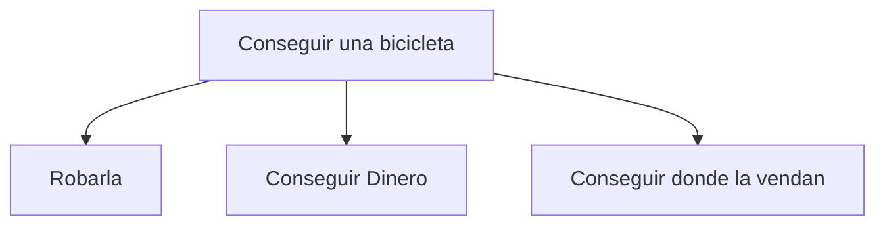

# Espacio estado y reduccion de problemas

## Espacio estado.

Una representación de espacio estado consiste en que un problema se divide en un conjunto de pasos de resolución desde el inicio hasta el objetivo.

Los conceptos importantes de este tipo de representacion son:

* Estado: es la descripción de una **posible** situación en el problema. Los estados se pueden representar de diferentes formas, por ejemplo con imágenes.

* Operadores: Representan un conjunto finito de acciones basicas que transforman unos estados en otros

* Técnicas de control: nos dice que operadores están disponibles dependiendo del estado.

* Tipos de estados: existen diferentes tipos de estados que son Iniciales, intermedios y finales.

    * Iniciales: el estado donde inicio el problema
    * Finales: el estado a donde tenemos que llegar
    * Intermedios: el conjunto de todos los demas estados 

> **Note** mas informacion de esta representacion [aqui](http://www.cs.us.es/cursos/ia1-2012/temas/tema-02.pdf) o [aqui](https://www.cs.upc.edu/~bejar/ia/transpas/teoria/2-BH1-introduccion_busqueda.pdf)

## Reduccion de problemas.

la reduccion de problemas seria descomponer un problema en varios subproblemas y a su vez, descomponer estos subproblemas hasta llegar a problemas primitivos que no se pueden descomponer mas.

un ejemplo seria el siguiente:

Aquí vemos que el problema principal es **conseguir una bicicleta**, este lo descomponemos y podemos solucionarlo de 2 formas que seria robando una bicicleta o comprando una bicicleta.

Para comprar una bicicleta tendríamos los subproblemas que son **conseguir dinero** y **conseguir donde la vendan**.

En el caso de que compremos la bicicleta, tenemos que solucionar los 2 subproblemas, por lo que sería un **AND** y tendríamos que señalar que están juntos uniendo los "vectores" con una línea que los atraviese.

Cuando los vectores no se unen con una línea que los atraviese, se considera que es un **OR** por lo que se puede solucionar el problema del que deriva si se soluciona alguno de los subproblemas.

> **Note** mas informacion respecto a esto [Aqui en la pagina 53](https://www.cic.ipn.mx/~sidorov/libroIA.pdf)

